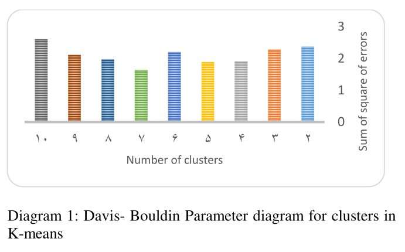
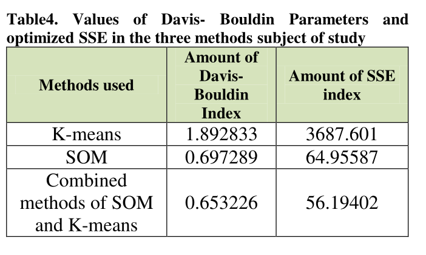

# Portfolio Optimization in Tehran Stock Exchange (TSE) 📈

This repository presents a research model for clustering and optimizing investment portfolios in the Tehran Stock Exchange using advanced data mining algorithms.

---

## 🇬🇧 English Description

### Abstract
The management of investment baskets and asset selection is a critical decision-making problem in the financial sector. This research aims to support investors and managers by developing a portfolio that considers realistic investor risk-taking behavior. The model uses data from 66 companies listed on the Tehran Stock Exchange.

### Methodology
The proposed model follows a multi-stage process:
* **Data Preparation**: Normalization of 24-month historical data using variance functions.
* **Feature Selection**: Five key indexes are used: Risk, Output (Return), Skewness, Liquidity, and Current Ratio.
* **Hybrid Clustering**: A combined method using **Self-Organizing Maps (SOM)** and **K-means**.

#### Cluster Validation & Visualization
To ensure the highest accuracy, we used the Davies-Bouldin index to find the optimal number of clusters and SOM for visual grouping:

*Figure 1: Analysis of the Davis-Bouldin index to determine the optimal number of clusters (k=7).*

*Figure 2: Visual representation of companies grouped into 7 clusters using the SOM neural network.*

* **Optimization**: Implementation of Genetic Algorithms to select the superior stocks.

### Key Findings
The research demonstrates that the hybrid approach significantly improves results compared to traditional methods.

*Table: Comparison of SSE and Davis-Bouldin values between K-means, SOM, and the Hybrid model.*

* The research identifies that **7 clusters** provide the most optimized grouping.
* The combined SOM and K-means method showed lower error rates (SSE) and better Davis-Bouldin index values.
* The resulting portfolio outperformed the general market index and the index of the 50 most active companies.

---

## 🇩🇪 Deutsche Beschreibung

### Zusammenfassung
Das Management von Investmentkörben ist eines der zentralen Entscheidungsprobleme im Finanzbereich. Diese Forschung unterstützt Investoren bei der Erstellung optimierter Aktienportfolios unter Berücksichtigung des realen Risikoverhaltens. Das Modell analysiert 66 an der Teheraner Börse gelistete Unternehmen.

### Methodik
Das vorgeschlagene Modell nutzt einen mehrstufigen Prozess:
* **Datenaufbereitung**: Normalisierung historischer 24-Monats-Daten.
* **Indikatoren**: Risiko, Rendite, Schiefe, Liquidität und Current Ratio.
* **Hybrides Clustering**: Kombination aus **Self-Organizing Maps (SOM)** und **K-means**.
* **Optimierung**: Einsatz von genetischen Algorithmen.

### Hauptergebnisse
* Die optimale Anzahl der Cluster wurde mit **7** identifiziert.
* Die kombinierte SOM-K-Means-Methode erzielte eine höhere Genauigkeit (geringerer SSE-Wert).
* Das optimierte Portfolio übertraf den allgemeinen Marktindex.

---

## 🔗 References & Links
* **Civilica (Official ID)**: [doc/342821/](https://civilica.com/doc/342821/)

## ⚠️ Data Privacy Note
Please note that the raw financial data for the 66 companies studied is confidential and is not included in this repository. Only the methodology and resulting model insights are presented here.
